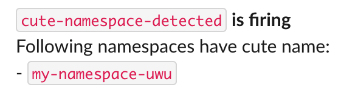

# Checkpoint

`checkpoint` is a Kubernetes policy checker.
Powered by [deno](https://github.com/denoland/deno).

## Why?

Ensuring a certain policy in a Kubernetes cluster is usually done by admission controllers.
But setting up an admission controller is quite cumbersome.
We need to set up a HTTPS web server and its certificates.

`checkpoint` provides a simpler way - writing a simple JavaScript code becomes a new admission controller.

`checkpoint` also aims to provide other convenient ways to ensure policies.

## Usage

More examples can be found at [`examples/` folder](./examples).

### ValidatingRule

ValidatingRule is similar to ValidatingWebhookConfiguration.
It can allow, deny incoming requests.

Write a ValidatingRule:

```yaml
apiVersion: checkpoint.devsisters.com/v1
kind: ValidatingRule
metadata:
  name: check-namespace-name-is-cute
spec:
  objectRules:
  - apiGroups: [""]
    apiVersions: ["*"]
    resources: ["namespaces"]
    operations: ["CREATE"]
  code: |
    const request = getRequest();
    if (!request.name.endsWith("-uwu")) {
      deny("That name is not cute.");
    }
```

Now your Kubernetes cluster only accepts namespaces with cute name:

```
$ kubectl create namespace my-namespace
Error from server: admission webhook "check-namespace-name-is-cute.validatingwebhook.checkpoint.devsisters.com" denied the request: That name is not cute.
$ kubectl create namespace my-namespace-uwu
namespace/my-namespace-uwu created
```

### MutatingRule

MutatingRule is similar to MutatingWebhookConfiguration.
It can allow, deny, or mutate incoming requests.

Write a MutatingRule:

```yaml
apiVersion: checkpoint.devsisters.com/v1
kind: MutatingRule
metadata:
  name: mutate-namespace-name-cute
spec:
  objectRules:
  - apiGroups: [""]
    apiVersions: ["*"]
    resources: ["namespaces"]
    operations: ["CREATE"]
  code: |
    const request = getRequest();
    const name = request.object.metadata.name;
    if (!name.endsWith("-uwu")) {
      const newObject = jsonClone(request.object);
      newObject.metadata.name = `${name}-uwu`;
      const patch = jsonPatchDiff(request.object, newObject);
      allowAndMutate(patch);
    }
```

Now your cluster automatically makes all namespaces cute:

```
$ kubectl create namespace my-namespace
namespace/my-namespace-uwu created
```

### CronPolicy

CronPolicy checks the cluster periodically and notify to specified webhook (e.g. Slack) if check fails.

Write a CronPolicy:

```yaml
apiVersion: checkpoint.devsisters.com/v1
kind: CronPolicy
metadata:
  name: cute-namespace-detected
spec:
  suspend: false
  schedule: "* * * * *"
  resources:
  - group: ""
    version: v1
    kind: Namespace
  code: |
    const [namespaces] = getResources();
    let names = "";
    for (const namespace of namespaces) {
      if (namespace.metadata.name.endsWith("-uwu")) {
        names += `- \`${namespace.metadata.name}\`\n`;
      }
    }
    if (names !== "") {
      setOutput({names});
    }
  notifications:
    slack:
      webhookUrl: "https://example.com" # Edit with your real Slack incoming webhook URL!
      message: |
        `{policy.name}` *is firing*
        Following namespaces have cute name:
        {output.names}
  restartPolicy: Never
```

Now your cluster is checked every minute if the cluster has cute namespaces.

If you create one:

```
$ kubectl create namespace my-namespace-uwu
namespace/my-namespace-uwu created
```

You will receive following Slack notification:



## License

This project is licensed under the terms of Apache 2.0. See [LICENSE](./LICENSE) for details.
